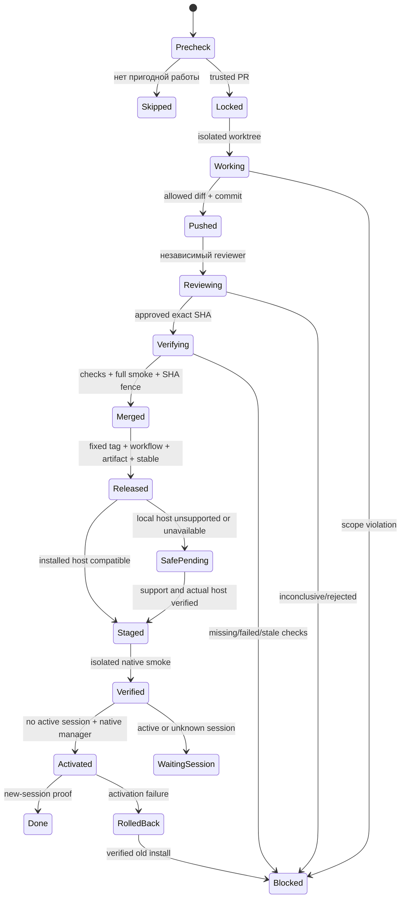

# Дизайн: автоматическое сопровождение

## Решения и подтверждённая исходная точка

Это quick-spec, без гейтов утверждения артефактов; разрешение публикации и включение расписания остаются отдельными обязательными human-gates. Работа данной роли ограничена этой спекой и игнорируемым доказательством `.tools/maintenance-evidence.design.md`. Приведённые ниже новые пути — конкретные целевые файлы реализации, не заявление об их существовании.

Прочитаны `src/compatibility.ts`, `src/apply-translations.ts`, `src/translations/types.ts`, `src/translations/ru.ts` в исторических тегах, `src/source.ts`, `src/source-templates.ts`, `src/host-adapter.ts`, `src/report.ts`, `package.json`, `scripts/export-source.ts`, `scripts/smoke-extension.ts`, `scripts/smoke-panel-worker.ts`, `.github/workflows/check.yml`, `.github/workflows/release.yml` и существующий `.kiro/specs/russian-settings/tasks.md`.

- В main два независимых запрета: `checkHostCompatibility` требует 18.8.0, а `applyTranslations` требует `pack.sourceOmpVersion === "18.8.0"`. Текущий реально установленный 18.8.4 не переводится. Это не повод откатывать хост.
- `v0.1.0:src/translations/ru.ts` указывает 18.6.1; `v0.2.0` — 18.8.0. Оба содержат полный darwin-вариант `spelling.autocomplete`. Исторические части читаются напрямую через `git show`, без checkout.
- Снимок `gh pr view 4 --repo narimanisakhanov-creator/omp-settings-ru --json number,title,author,headRefName,headRefOid,baseRefName,isCrossRepository,files,statusCheckRollup,mergeStateStatus` подтвердил кандидата 18.8.4, автора `app/github-actions` с `is_bot: true`, same-origin, base main, branch `upgrade/omp-18.8.4`, SHA `d5c4c3ca5c5e01afb511ae527f973da8e693b9df`, пустые checks и UNSTABLE. Пустые checks — блок публикации, не успешная проверка.
- По переданному проверенному diff, 18.6.1 → 18.8.0 добавляет 6 путей, меняет 10, ничего не удаляет; 18.8.0 → 18.8.4 меняет только `title.icons`. Его новый исходник: `Icon and short code that head new generated session titles`. До содержательного ревью новый вариант не активен; финальная реализация обязана дать 404/404, не остановиться на 403/404.
- Контекстная фраза «18.8.0 не имеет upgrade» исправлена руководителем: upgrade там есть для marketplace. `omp plugin install --help` на текущем 18.8.4 показывает upgrade и install/path targets, но не доказывает поддержку закреплённого tarball в upgrade. Выбор команды зависит от обнаруженных и испытанных capabilities, не номера версии или наличия слова upgrade.
- CI сейчас имеет Windows/Linux и один dev-host, не матрицу host-version/platform. Комментарий `check.yml` о «только 18.6.1 Windows exercised» — историческое ограничение, не факт текущей поддержки 18.8.4. `smoke-panel-worker.ts` сам пишет `isolated: true`: полезный доменный/панельный smoke, не запуск установленного `omp.exe`.
- `packageManager` и CI закреплены на Bun 1.3.14, текущий Bun 1.4.2 по переданному наблюдению. Решение реализации: единообразно закрепить 1.4.2 в packageManager, CI и evidence runner, релевантные зависимости менять только Bun. `npm pack` в release сохранить: упаковка не установка зависимости, менять формат и allowlist ради гигиены не требуется. Не добавлять отдельный package-manager hygiene проект.

## File Structure Plan

| Компонент | Реальный целевой путь | Изменение |
|---|---|---|
| Конечные типы каталога | `src/translations/types.ts` | SourceVariant, единственный path-keyed LocalePack |
| Сборка каталога | `src/translations/ru.ts` | один каталог, без sourceOmpVersion gate |
| Переводы | `src/translations/ru-part-1.ts`, `src/translations/ru-part-2.ts`, `src/translations/ru-part-3.ts` | базовые строки плюс исторические варианты |
| Исторические дельты | `src/translations/ru-variants.ts` (новый) | только отличающиеся варианты 18.6.1 и 18.8.4 |
| Выбор исходника | `src/translations/resolve.ts` (новый) | path/hash/platform resolver |
| Структурная граница | `src/compatibility.ts`, `src/host-types.ts`, `src/host-adapter.ts` | finite validation, safe refusal |
| Владение и восстановление | `src/apply-translations.ts`, `src/language-controller.ts`, `src/index.ts` | общий resolver, прежний descriptor ownership |
| Нормализация и hints | `src/source.ts`, `src/source-templates.ts` | retained templates, существующий простой dynamic hint механизм |
| Отчёты | `src/report.ts` | тот же resolver и metadata версии/платформы |
| Экспорт и покрытие | `scripts/export-source.ts`, `scripts/check-coverage.ts`, `scripts/diff-upstream.ts` | explicit version/platform inputs |
| Матрица | `scripts/check-matrix.ts` (новый), `baseline/18.6.1-{win32,darwin,linux}.json`, `baseline/18.8.0-{win32,darwin,linux}.json`, `baseline/18.8.4-{win32,darwin,linux}.json` | 9 снимков и pinned host bundles |
| Конечная поддержка | `baseline/supported-hosts.json` (новый) | точные версии/платформы и hash/evidence records, автоматический candidate refresh |
| Installed-host smoke | `scripts/smoke-installed-host.ts` (новый) | настоящий executable, профиль, native plugin manager, PTY |
| Контроллер CLI | `scripts/maintenance.ts` (новый) | precheck/run/resume/status |
| Доверенная политика | `maintenance.config.json` (новый) | allowlist, provider, limits; читается из закреплённого base |
| Состояние и блокировки | `scripts/maintenance/state.ts` (новый) | atomic state, single writer, effect reconciliation |
| Проверка PR и публикация | `scripts/maintenance/github.ts` (новый) | trusted PR, exact-SHA checks, merge/tag/release wait |
| Агенты | `scripts/maintenance/orca.ts` (новый) | installed CLI argv, Run/Task/Dispatch lifecycle |
| Локальный установщик | `scripts/maintenance/updater.ts` (новый) | stage/verify/activate/rollback |
| Расписание | `scripts/maintenance/automation.ts` (новый) | disabled, hourly, bounded precheck |
| Review manifest | `src/translations/variant-review.json` (новый) | provenance и явный semantic verdict, не runtime инструкции |
| Доменная регрессия | `test/translation-lifecycle.test.ts`, `test/report.test.ts`, `test/source.test.ts`, `test/language-controller.test.ts`; `test/maintenance.test.ts` (новый) | selection/lifecycle/controller/updater invariants |
| Связь команды и поставки | `package.json`, `bun.lock`, `scripts/check-release.ts` | pinned dependencies, scripts, distribution allowlist |
| CI и выпуск | `.github/workflows/check.yml`, `.github/workflows/upstream-watch.yml`, `.github/workflows/release.yml` | авторизованный implementation bootstrap; reusable выпуск |

Состояние внешнего контроллера хранится в текущем пользовательском state-каталоге отдельно от дерева и plugin runtime; evidence относительный и очищенный. Не добавлять controller/state/config в пакет плагина. `scripts/check-release.ts` проверяет границу поставки. Глобальные PATH, auth и keys не изменяются.

## Один каталог: конкретная граница типов

```typescript
type SourcePlatform = "win32" | "darwin" | "linux";
type ReviewedHostVersion = string; // validated exact semver in finite support manifest
interface SourceVariant extends SettingTranslationFields {
  readonly platform: SourcePlatform | "common";
  readonly observedIn: readonly ReviewedHostVersion[]; // provenance, NOT selection
}
interface SettingTranslation {
  readonly variants: readonly SourceVariant[];
}
interface LocalePack {
  readonly locale: "ru";
  readonly settings: Readonly<Record<string, SettingTranslation>>;
}
function resolveVariant(
  entry: SettingTranslation,
  ui: HostUiMetadata,
  platform: SourcePlatform,
): SourceVariant | undefined;
```

Не создавать каталоги по версии и не выбирать по `host.version`. Каждая настройка имеет один entry; неизменённая variant используется совместно с provenance версий, старые и удалённые пути остаются. Тип границы — обычные readonly records/arrays и существующий `HostMetadata`, без generic framework. ReviewedHostVersion — валидированная строка только tooling metadata; конкретный конечный набор испытанных версий хранится в `baseline/supported-hosts.json` (новый), а не в захардкоженном трёхэлементном union. Никакой сети или manifest refresh в runtime.

Resolver проходит варианты заданного пути: сначала точная платформа, затем common. Common разрешён только если он действительно проверен для этой платформы; `spelling.autocomplete` на darwin не может попасть на common без `apple`. Для каждого кандидата normalize использует именно его retained `descriptionSource`. Первый точный SHA-256 match возвращает неизменный объект variant; отсутствие match оставляет ВСЮ настройку английской, а не смешивает устаревшие options с новым описанием. Несколько совпадений одной специфичности с различными переводами — `ambiguous-source-variant`, отказ до мутации. При одинаковом hash разные платформенные варианты допустимы только с согласованными текстами/подтверждённым platform precedence. Каталог валидируется один раз, не на каждое отображение.

`host.version` лишь маркирует report как `verified` для испытанной пары либо `structural-fallback`; неизвестная будущая версия с поддержанной структурой проходит без version switch. Неподдержанная платформа, import failure, malformed UI, unsafe getter/setter, duplicate setting IDs, duplicated option values — skipped с кодом причины до изменения реестра. Совместимость структуры не означает поддержку всего будущего API; adapter imports остаются lazy и failure boundary сохраняется.

### Горячий compiled path

Сохранить существующий простой dynamic hint механизм `captureHints` и getter. Hash сейчас вычисляется в buildPlan, не при каждом render; не выдумывать render hash optimization. Убирать только конкретную добавляемую стоимость resolver: не копировать variants/entries на lookup, не нормализовать и не хэшировать один ui/template повторно при проходе одинаковых source variants. Прямой возврат readonly variant; необходимые descriptor snapshots/option clones для безопасного rollback сохранить. Не разворачивать migration в новый compiled hint framework и не менять живые keybindings. Existing hint getter продолжает возвращать English при несовпадении шаблона; отдельно проверяются recovery и последующая application.

### Историческое восстановление и semantic pin

Из `v0.1.0` извлечь русские варианты всех 398 путей, сравнить с `v0.2.0`, объединить идентичные без copied catalogs. Десять изменённых путей: `advisor.immuneTurns`, `browser.tern`, `claudeResets.keepCredits`, `claudeResets.salvageHorizonHours`, `codexResets.salvageHorizonHours`, `composer.tokenRate`, `computer.display`, `computer.maxHeight`, `computer.maxWidth`, `statusLine.compactThinkingLevel`. По уточнению руководителя unchanged variants наследуют existing baseline/catalog proofs и один catalog-hash invariant, не ~1200 повторных review rows. Explicit semantic review rows нужны для 10 changed paths, 6 additions (`expandThinkingBlocks`, `providers.muse-code.storeResponses`, `title.generator`, `title.icons`, `tui.autoGraph`, `tui.renderSvg`), нового title.icons 18.8.4 и darwin spelling.autocomplete. Compact manifest содержит sourceTag/sourceCommit/catalogHash плюс delta rows `{path, platform, sourceHash, translationHash, verdict, reviewerEvidence}`. Hash invariant проверяет историческую реконструкцию всех вариантов; reviewer проверяет каждый новый/изменённый/platform variant, re-pin не разрешён. До acceptance title.icons с новым hash English; финальная реализация даёт правильный новый русский смысл и 404/404.

## Отчёты и доказательство support

`src/report.ts` использует ровно тот же resolver, что application. Snapshot остаётся `{version, platform, settings: {path: normalizedSource + sourceHash}}`; поддержать несколько description templates на путь, выбирая только literal-compatible шаблон. Нельзя подменять `process.platform` и выдавать это за native test: foreign-platform export из исходных веток помечается `source-derived`; native host evidence хранится отдельно. Coverage содержит `hostVersion`, `platform`, `support: verified|structural-fallback`, complete/partial/untranslated/sourceHashMismatches; drift сохраняет added/removed/changed. Removed paths не удаляются из каталога.

Matrix runner собирает Bun-pinned bundles для текущего finite support manifest: начальные 18.6.1/18.8.0/18.8.4 с 398/398, 404/404, 404/404 и 0 hash mismatches на каждой платформе. Native CI Windows/Linux/macOS подключается в уже авторизованной реализации без нового approval gate. Old native binaries можно получать во временный каталог, никогда заменяя основной установленный хост. Отсутствующий native binary/runner остаётся непроверенной парой. По подтверждённому решению координатора peer range `18.6.1 || 18.8.0 || 18.8.4` означает проверенную совместимость package API, НЕ обещание установленной панели на каждой платформе. Native installed-panel runs записываются отдельно в installedEvidence manifest; отсутствующие Linux/macOS/исторические native runs остаются unverified. Широкое `>=` запрещено; structural fallback не peer promise.

CI получает finite accepted versions UNION candidate version и platform mapping из metadata/config, без статического списка версий в workflow или requiredChecks. Required-check template явно соответствует новому имени job `check ({os}, {version})`; наблюдавшийся исторический run 37765868816 имел `check (windows-2025)`, `check (ubuntu-24.04)` и `hygiene`, но новую матрицу до push не выдаём за исполненную CI.

Automatic refresh step: после precheck/lock и до executor review контроллер закрепляет candidateVersion из branch+exact dependency pins, экспортирует `baseline/<candidate>-<platform>.json` для всех трёх platform source, запускает diff/coverage against retained catalog и добавляет changed/added variants для semantic review. Pinned native binaries в temp profiles проходят matrix и installed smoke. На этом основании executor записывает proposed support records в `baseline/supported-hosts.json` и точные peers вместе с сохранёнными старыми baselines в единственный candidate commit. Manifest имеет version/platform/baselineHash/artifactHash, без self-referential commit SHA; exact commit связывается внешним verification receipt. Independent reviewer и CI/full native smoke проверяют уже финальный commit, включая records. Только успешный exact-SHA gate делает candidate support authoritative для публикации/updater; никакой post-verdict metadata mutation. Любое изменение SHA повторяет gate. Unverified candidate остаётся pending; runtime known-source fallback продолжает работать, reviewed set не захардкожен.

Installed-host smoke запускает реальный executable каждой пары, native install/link в одноразовом профиле, новую main session, `/settings`, русский поиск, безопасное bool/enum изменение, ru/en/ru и закрытие/новую English session. Проверяет native plugin list/doctor и реальные видимые значения; наблюдение registry или `SettingsSelectorComponent` не заменяет executable. Ни конфиги текущего профиля, ни credentials не читаются для smoke. Текущий принятый хост — 18.8.4. PTY capture передаётся presentation workstream вместе с hostVersion/platform/executableHash/pluginHash/SHA/размером терминала, без transcript с пользовательскими данными; снимки в существующий `docs/screenshots/` после отдельного визуального выбора. Контроллер ждёт structured smoke verdict от этого runner, не картинку как единственное доказательство.

`orca terminal show` подтвердил connected/writable terminal с ptyId. Native pixel capture реально доступен: coordinator выполнил `orca computer get-app-state --app Orca --window-id 524936 --json`, receipt `.tools/orca-capture-proof.json` прочитан этой ролью: PNG 1936×1168 scale=1, screenshotStatus=captured, 176 nodes, no truncation. Provider `orca-computer-use-windows` v1.0.0/screenshot=true и PNG 275759 bytes подтверждены coordinator; presentation audit независимо получил 1230×700 PNG. Для будущего capture открыть именно smoke PTY pane, определить актуальный windowId через list-windows и снять реальные пиксели get-app-state; sanitize/crop только own smoke pane. Размер берётся из window state, moveResize недоступен. Terminal read — текст, не screenshot. No-PTY fallback не нужен; эта capture-probe доказывает механизм, не сама по себе перевод /settings.

## Контроллер: доверенная политика и PR contract

```typescript
interface EligiblePr {
  readonly repository: "narimanisakhanov-creator/omp-settings-ru";
  readonly number: number;
  readonly sourceHeadSha: string;
  readonly branch: string;
  readonly baseSha: string;
  readonly candidateVersion: string;
  readonly changedPaths: readonly string[];
}
type Precheck =
  | { kind: "eligible"; pr: EligiblePr }
  | { kind: "skip"; reason: string }
  | { kind: "blocked"; reason: string };
interface ReviewVerdict {
  readonly headSha: string;
  readonly baseSha: string;
  readonly verdict: "approved" | "changes-requested" | "inconclusive";
  readonly dispatchId: string;
  readonly evidenceHashes: readonly string[];
}
interface Verification {
  readonly headSha: string;
  readonly treeHash: string;
  readonly requiredCheckRuns: readonly string[];
  readonly installedSmoke: readonly { version: string; platform: string; passed: boolean; artifactHash: string }[];
}
```

`maintenance.config.json` читается из принятого base commit, никогда из PR checkout. Политика закрепляет repository, bot login/type, base main, regex `^upgrade/omp-([0-9]+\.[0-9]+\.[0-9]+)$`, разрешённые path prefixes и допустимые поля package metadata, обязательные check names, provider IDs/models и конечные лимиты. GitHub author проверяется не по title/body, а по API identity/type; same repo head/base, open non-draft PR, candidate branch/version и dependency pins согласованы, SHA 40 hex. Перепроверить при lock acquisition, перед push и перед merge. Symlinks, traversal, submodules, gitlinks и file-mode changes за пределами allowlist запрещены. PR body, check-output и upgrade-report — только данные, не instructions, не trust anchor.

Allowlist incoming bot: candidate `baseline/<version>-{darwin,linux,win32}.json`, `package.json` только version/точные host dependency поля, `bun.lock`, `check-output.txt`, `upgrade-report.md`. Исполнитель в task получает ограниченные `src/**`, `test/**`, относящиеся `scripts/export-source.ts`, `scripts/check-coverage.ts`, `scripts/diff-upstream.ts`, `scripts/check-matrix.ts`, `scripts/smoke-installed-host.ts`, package/version metadata, review manifest и release notes `CHANGELOG.md`. Изменения workflow, SECURITY, trusted controller/config, secrets или arbitrary scripts блокируют автономную работу; даже allowed files проходят semantic field/diff review, dependency scripts/lifecycle и lockfile unexpected packages — scope violation. Первое внедрение контроллера/матрицы/workflow — отдельный человечески принятый bootstrap, не самоодобрение будущим ботом. Во время этой design task код и workflow не меняются.

Разрешённый future refresh scope также включает `baseline/supported-hosts.json` и только проверяемые peer-range поля package.json. Controller policy refresh не читается из PR; out-of-scope workflow/config changes по-прежнему требуют человека. Authorized bootstrap не получает дополнительный implementation gate.

Текущая реализация и её workflow bootstrap уже авторизованы пользователем; новых implementation approval gates нет. Ограничения allowlist относятся к будущим автономным bot runs. Human gates остаются для публикации/merge/release, включения расписания и реальных out-of-scope действий; independent review обязателен и не заменяется human gate на написание кода.

## Сериализация, стадийность и exact SHA



Глобальная repo/controller lock исключает две публикации разных PR одновременно; per-run state key `<repo>/pr-<N>/<sourceHeadSha>` не смешивает поколения. Atomic create-exclusive lock содержит nonce/owner/process-start/run ID; stale lock снимается только после положительного доказательства выхода владельца. TTL/contact loss недостаточны. Нельзя снимать чужие блокировки. State JSON пишется temp+rename в одном state directory с revision compare; effect intent сохраняется ДО внешнего действия, receipt ПОСЛЕ, restart reconciles GitHub/Orca/native manager прежде повторения. Хранить `sourceHeadSha`, `workingHeadSha`, `reviewedHeadSha`, `mergeSha` раздельно: собственный push не создаёт бесконечно новую задачу. Внешнее изменение головы инвалидирует review/tests, новое поколение требует precheck; never force push.

`MaintenanceState` содержит schemaVersion=1, key, revision, stage, attempt, deadlines, worktreeId, runId, dispatch IDs, current hashes, intended tag/packageVersion, effect receipts, verdict/evidence hashes, release asset ID/hash, previous install manifest, update status и sanitized refusal code. Конечные deadline: precheck 30 s, GitHub command 30 s, agent task 45 min, CI/smoke 30 min, release 20 min, updater stage/verify 10 min; автоматические повторения read-only network максимум 3 с 2/5/10 s backoff; мутации повторять только после reconciliation. Deadline исчерпан — blocked; неизвестная PTY liveness — unverifiable, не kill/retry.

В отдельном свежем worktree checkout только pinned PR/base. Не stash/reset/checkout/delete current human tree. Before commit сравнить diff allowlist и рабочее состояние isolated tree; own changes only. Version bump — один patch от current base packageVersion с проверкой reserved tags/PR state; существующий tag с другим SHA — tag-conflict, не перезаписать. Записать собственный commit, push обычным fast-forward при совпадающей remote-head fence, получить новый SHA, reviewer работает именно на нём read-only и независимо от executor. Reviewer verdict приложения не равен фиктивному GitHub self-approval: required human reviews/branch protections соблюдаются, при невозможности блокировать.

Каждая будущая maintenance Task получает новое `new-child` или `new-top-level` дерево через installed Orca; `current` root запрещён. Executor и reviewer могут использовать только созданный isolated selector, никогда coordinator root. Только нынешняя отдельно контролируемая фаза реализации может работать в root; расписание не наследует это исключение.

CI gate требует непустой список exact named checks со status completed/conclusion success, принадлежащих текущему reviewed SHA; pending, skipped, neutral, cancelled, missing и previous SHA не годятся. Full installed smoke attestation связывает tree/artifact hashes и тот же SHA. Если provider CI запускается на synthetic merge commit, дополнительно доказать parents/base/tree correspondence и проверку head SHA; не выдавать base check за PR check. При изменившемся base повторить review/verify. Merge через native GitHub contract с `match-head-commit`; требуемые защиты не обходить admin. После merge проверить PR state MERGED/CLOSED и mergeSha; tag фиксируется на mergeSha. Любая политика tag privilege без доступного разрешения — human gate.

Publication privacy gate — реальный закреплённый Gitleaks release, offline с `--redact`, по всем reachable git refs, текущим файлам isolated worktree и распакованному финальному пакету. Evidence хранит версию/хэш scanner и redacted findings/counts, не secrets. Текущий аудит выполняет отдельный поток; контроллер принимает его exact-SHA/artifact-bound verdict. Самописная regex может быть дополнительным фильтром, но никогда не полным доказательством отсутствия секретов. Missing/inconclusive scanner result блокирует publication.

`release.yml` переиспользуется после утверждённого bootstrap: validate package/tag, checks, pack, SHA256SUMS, release, stable. Existing same tag/release только reconciled: target SHA, package version и asset hash должны совпасть. Never overwrite tag/release assets. Дождаться успешного workflow, опубликованного non-draft release, пакета и checksums, stable ref равного mergeSha. SHA256SUMS лишь целостность; authority определяется same repository/tag resolved to accepted mergeSha + successful trusted workflow + frozen expected asset ID/hash. Stable — только readiness, не mutable install target. Если указатель уже ушёл дальше, не устанавливать плавающий stable, а перепроверить fixed release или блокировать конфликт.

## Установленные Orca контракты

Проверены guides `orca skills get orca-cli`, `orca skills get orchestration`, automations reference; help `orca automations create --help`, `orca orchestration worker-start --help`. Текущий CLI принимает bounded `--precheck`, `--precheck-timeout`, hourly, disabled, new-per-run. `worker-start` имеет `--agent`, `--model`, `--effort`, `--run`, `--spec`, `--worktree`, `--deps`; OMP effort не поддерживается, effort только вместе с поддержанным model. Не создавать provider или alias по догадке: выбранные executor/reviewer providers из доверенной принятой конфигурации должны быть доступны установленной Orca. Недоступный provider — blocked-provider, не другой самодельный subprocess.

Адаптер argv запускает `orca orchestration run-create`, затем executor `worker-start --spec <trusted bounded text> --worktree <exact isolated selector> --agent <verified provider> --run <runId> --json`; reviewer — новый read-only agent task, новый Dispatch в том же isolated selector, после push/SHA fence. Все значения передаются argv, не interpolated shell. Идентификаторы только из receipts. Если receipt не ready, сохранить failedStage/residualResources, не duplicate launch. Каждая задача использует установленный permission policy; custom auto-approval flags запрещены. Supervised workers обязаны `worker_done` с Task+Dispatch IDs; controller обрабатывает inbox deliveries, отвечает на вопросы блокировкой/человеком, проверяет active Dispatch и verdict, освобождает только settled worker. Empty reply/contact loss не success. Agent prompt содержит Target/Change/Constraints/Ownership/Acceptance из trusted config плюс отдельно ограниченные PR data, а не PR body instructions.

## Локальный updater contract

```typescript
interface ReleasePin {
  readonly tag: string;
  readonly commitSha: string;
  readonly assetId: number;
  readonly sha256: string;
  readonly packageVersion: string;
  readonly supportedPairs: readonly { hostVersion: string; platform: SourcePlatform }[];
}
interface InstalledHost {
  readonly version: string;
  readonly platform: SourcePlatform;
  readonly executableHash: string;
}
interface ManagerCapabilities {
  readonly installVerifiedPath: boolean;
  readonly replaceVerifiedPath: boolean;
  readonly pinnedUpgradeTarget: boolean;
  readonly isolatedProfile: boolean;
  readonly userScope: boolean;
}
interface UpdateReceipt {
  readonly phase: "staged" | "verified" | "activated" | "rolled-back" | "safe-pending" | "deferred" | "blocked";
  readonly pin: ReleasePin;
  readonly previousPackageHash: string;
  readonly smokePassed: boolean;
  readonly refusal?: string;
}
```

Read actual `omp --version` и `omp plugin list --json` перед stage и ещё раз перед activate; не использовать devDependency version как установленную. Exact hostVersion/platform должна быть в supportedPairs; structural-fallback недостаточен для автономной установки. Fixed release metadata и tarball hash сверяются до распаковки; запрет абсолютных paths, traversal, symlink escape, unexpected files/lifecycle scripts. Stage в controller-owned user state, отдельный пакет и одноразовый профиль; source install не меняет рабочую установку. Verify native manager в isolated profile + executable smoke на том же binary. Профиль задаётся только проверенным нативным контрактом хоста; если безопасная изоляция недоказана, `profile-isolation-unverified`, не запуск в real profile.

Если local OMP не доступен, версия/платформа не совпала с supportedPairs или релизная совместимость не проверена, updater возвращает `safe-pending`: activate не вызывается, previous working install нетронут, задача остаётся pending. Controller release stage может быть успешным, но end-to-end задача не Done. Это отличается от runtime `skipped` для структурно несовместимого хоста. Проверяемая локальная фактическая версия сейчас omp/18.8.4; stage → verify → activate выполняется ДО открытия новой рабочей сессии.

Нативная стратегия: если **проверено**, что upgrade принимает fixed verified package target, использовать его с user scope; marketplace-only upgrade не подходит. Иначе tested native install verified local package/path с `--force --scope=user` после dry-run; никаких `omp plugin update`. Link допустим только для изолированного smoke, не финальной постоянной установки. Help доказывает syntax install/path/scope, но replacement/pack-target semantics и rollback должны быть реально испытаны реализацией до разрешения финальной стадии. Нельзя отгадывать hidden directory layout и переписывать node_modules вручную.

До activation сохранить предыдущий установленный package byte-for-byte, manager metadata/enabled state, hash и воспроизводимый локальный target для rollback. Проверить отсутствие local human edits относительно предыдущего verified manifest: иначе `local-install-modified`, не затереть. Отдельная activation lock и подтверждение отсутствия активных main sessions; при неизвестной liveness — deferred, не kill host. Не менять файлы уже работающей сессии. Native replacement только на разрешённой финальной стадии текущего user profile; re-read list/doctor, новая main session smoke, expected version/hash/enabled/translation proof. Если post-activation failure, той же испытанной native операцией восстановить previous bytes/metadata, открыть отдельную новую smoke session и проверить English/Russian restore; rollback failed — критический blocked, без Done. Previous working backup не удалять до verified activation и не выдавать verified rollback без запуска old package. Сам OMP никогда не обновляется.

## Расписание и precheck

`bun run maintenance --precheck` — read-only, bounded 30 s, код 0 только eligible PR и свободная подтверждённая lock; 10 no-work/duplicate, 11 unsafe PR, 12 network/deadline, 13 lock/unknown authority. Вывод sanitized `{kind, reason, number, headSha}`; nonzero Orca записывает skipped run, controller status различает unsafe blocked от no-work. До worktree/worker-start пройти свежий precheck ещё раз под lock.

`scripts/maintenance/automation.ts` idempotently сверяет existing automation repo/name/prompt/config digest. Создание: installed `orca automations create`, name `omp-settings-ru-maintenance`, trigger `hourly`, precheck с absolute command path из текущего verified checkout, trusted prompt, verified provider, exact repo selector, workspace-mode `new-per-run`, fresh-session, `--disabled`. CLI `--precheck-timeout` обнаружен, но единица не описана help: выяснить через agent-context schema/disabled run; до этого hard timeout обеспечивается самим precheck, не угадывать единицу. Gate proof обязателен: no-work precheck не создаёт worktree, eligible создаёт только одно, blocked не запускает агент. Prompt не включает сырые PR instructions. Расписание остаётся disabled во время разработки/доказательств; включение только отдельным director acceptance, не на основании agent success. Эта design role не создаёт и не включает automation.

## Ошибки и проверяемые инварианты

| Ошибка | Поведение и recovery |
|---|---|
| unknown source hash/path | оставить English, report mismatch; не менять pin автоматически |
| incompatible structure/import/unsafe descriptor | skipped до мутации; сохранить оригинал |
| ambiguous variant/conflicting aliases | atomic refusal; содержательное ревью |
| partial write/restore failure | existing reverse journal, повтор restore, не терять ownership |
| untrusted PR/scope/dependency surprise | blocked-human; не executor/publish |
| external SHA/base change | invalidate reviewer/tests; recheck под lock |
| CI missing/inconclusive reviewer | blocked-verification; no merge/tag/install |
| duplicate tag/release matching state | reconcile receipt, не recreate |
| tag/hash/asset discrepancy | blocked-integrity; no activation |
| active session/local modified install | deferred/blocked; preserve old bytes |
| activation failure | native rollback + actual old smoke |
| unknown worker/session/lock liveness | unverifiable; no duplicate or forced cleanup |

## Стратегия проверки

Политика репозитория: домен + e2e, без лишних wiring/source-text/mocked echo tests. До реализации добавить failing domain tests selection реальных English metadata 18.6.1/18.8.0/18.8.4 из baselines с истинными translated outputs: изменённые 10 paths, `title.icons`, darwin apple, untouched strings будущего структурно совместимого version, changed unknown English, removed retained setting. Recovery/error tests используют настоящие descriptors/getters/options и domain failure injection: атомарность, foreign edits, partial rollback retry, idempotent ru/en/ru, dynamic hint changes и новые application после restore. Строка присутствует в файле — не проверка поведения.

Domain controller tests работают с реальным state transition reducer и конечным file state, typed observations на входе: missing checks запрещает merge, stale SHA запрещает reviewer reuse, lock prevents duplicate, effect receipt reconciliation, duplicate release mismatch, out-of-scope PR injection никогда не становится prompt instructions. Не тестировать mock forwarding. Updater domain tests проверяют integrity/platform compatibility и transitions; e2e через реальный installed-host manager подтверждает stage/verify/activate/rollback, сначала только одноразовые профили. Throwaway fault exercise на native replacement доказывает rollback; никаких изменений текущего install до acceptance. E2E automation proof через disabled registration/run и реальные Orca receipts, no-work no worktree. Network/publishing effects в проверке controller выполняются только с отдельно предоставленным разрешением, never fake success.

## Traceability

| Требование | Компонент/контракт | Наблюдаемая проверка |
|---|---|---|
| 1.1 | `src/translations/resolve.ts`, path/hash/platform | real source metadata → exact translated fields |
| 1.2 | `src/translations/ru-variants.ts`, retained variants | old/new/removed path selection |
| 1.3 | `src/compatibility.ts`, structural fallback | future version known vs changed English |
| 1.4 | adapter + compatibility + mutation boundary | malformed host refuses untouched |
| 1.5 | `variant-review.json`, semantic gate | changed hash without review blocked |
| 1.6 | tag reconstruction + catalog invariants + delta review | historical proofs reused; changed/platform variants reviewed |
| 1.7 | immutable resolver + existing hints | no added copies or repeated ui/template hashing |
| 1.8 | `apply-translations.ts`, domain lifecycle | restore/errors/foreign-edit outcomes |
| 1.9 | new title.icons variant + coverage | reviewer-approved 18.8.4 404/404 |
| 2.1 | `src/report.ts`, matrix/export tooling | 9 version/platform reports |
| 2.2 | CI + `smoke-installed-host.ts` | actual executable native installed plugin |
| 2.3 | PTY evidence contract | presentation receives actual surface captures |
| 2.4 | package/lock/workflow pins | frozen Bun-only dependency resolution |
| 2.5 | exact peers + verified support metadata | no broad version promise |
| 2.6 | controller candidate refresh + `baseline/supported-hosts.json` | new baseline and finite supported set accepted on final exact SHA |
| 3.1 | github precheck + pinned policy | identity/origin/branch/SHA/path rejection |
| 3.2 | semantic allowlist + human gate | forbidden workflow/secret diff blocked |
| 3.3 | state/lock/worktree finite machine | serial/crash resume/deadline |
| 3.4 | Orca adapter + bounded trusted prompts | installed launch receipt; no approval bypass |
| 3.5 | isolated executor diff/commit/push/reviewer | remote-head fence + independent verdict |
| 3.6 | exact-SHA verification | missing/inconclusive/stale checks block |
| 3.7 | merge/release pin contract | merged PR, fixed tag, asset, stable |
| 3.8 | effect reconciliation + SHA generations | no duplicates or stale reviewer reuse |
| 3.9 | updater receipt + Done gate | activated new session or safe-pending, never false Done |
| 3.10 | external-only network/evidence sanitizer | package boundary and sanitized receipts |
| 4.1 | installed host + ReleasePin | actual version/platform/hash acceptance |
| 4.2 | updater stage/verify/activate | isolated proof before session activation |
| 4.3 | native backup/rollback | previous package exercised after failure |
| 4.4 | manager capabilities | marketplace-only vs pinned install path |
| 4.5 | user profile activation boundary | PATH/auth/keys/host unchanged |
| 4.6 | session lock + local manifest | unknown/live/modified install preserved |
| 4.7 | safe-pending updater state | unavailable/mismatched host preserves previous install |
| 5.1 | maintenance CLI precheck + hourly automation | 0 only trusted eligible |
| 5.2 | precheck gate before worktree | no-work/timeout no worker |
| 5.3 | disabled registration + director gate | enabled false until explicit acceptance |
| 5.4 | repo lock + idempotent registration/state | duplicate job skipped |

## Остаточные внешние условия

Спека завершена; implementation авторизована, следующие условия блокируют автономную публикацию/активацию, не создание дизайна или bootstrap. PR #4 не имеет checks: проверенный blocker. Installed 18.8.4 native smoke/rollback, pinned-target replacement и session detection ещё не выполнены этой ролью; help не доказывает семантику. Changed/added/platform delta variants требуют independent semantic review, unchanged variants используют исторические proofs. Native Linux/macOS support evidence не предоставлено; не обещать поддержку из baseline. Pixel capture механизм подтверждён receipt coordinator и presentation audit, реальную /settings surface проверяет presentation workstream. Executor/reviewer provider pair/model сверяется с actual installed Orca. Единица precheck-timeout неизвестна из help; deadline обеспечивается самим CLI. Не выполнялись merge/tag/push/install/enable; human publication и schedule acceptance не подразумеваются quick-spec.
