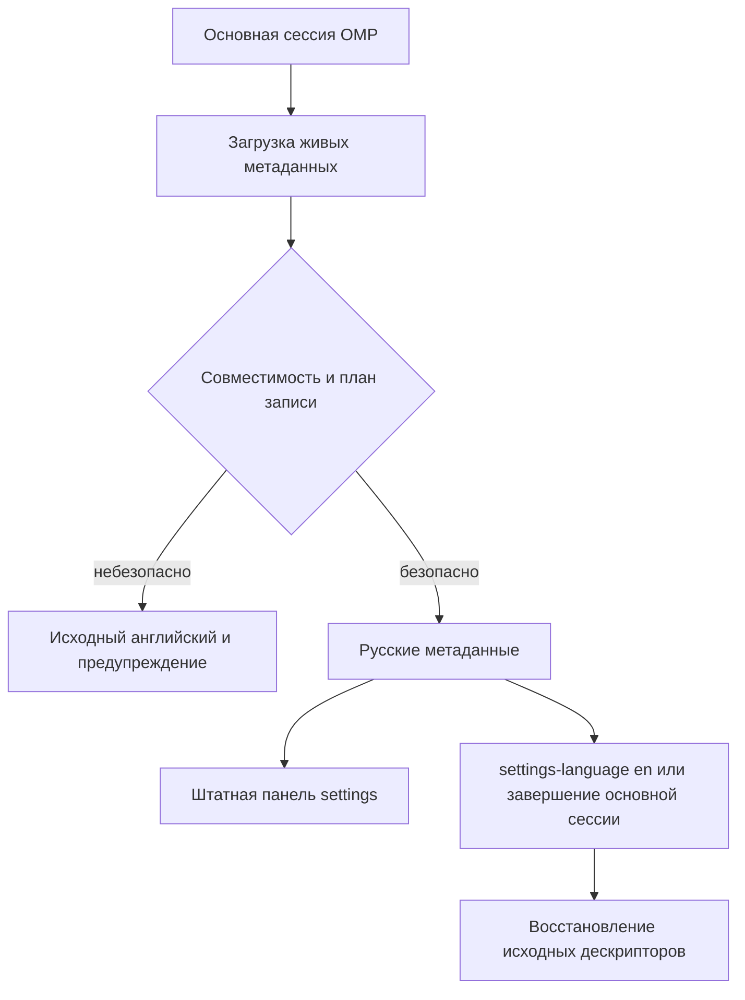

# Дизайн: omp-settings-ru

Статус: требования, дизайн и задачи одобрены; реализация и проверки завершены на Windows x64 / OMP 18.6.1. 2026-10-06 владелец разрешил коммит и публичную GitHub-публикацию; выпуск готовится. Доказательства и непроверенные платформы — в tasks.md и CHANGELOG.md.

## Решение и границы

Самостоятельное расширение для перевода отображаемых метаданных штатной панели `/settings`. Не форк OMP, не замена панели и не патч исполняемого файла. За основу защитного механизма применяется код `rockythink/omp-settings-zh` под MIT с сохранением авторства Elazer. Механизмы перевода статистики, установки PATH-обёрток и дополнения slash-команд не переносятся.

Переводятся названия, описания, предупреждения и отображаемые подписи статических вариантов. Значения вариантов, пути настроек, вкладки и идентификаторы групп не меняются. Русский поиск и изменение значений проверяются в реальном OMP: наличие переведённых метаданных само по себе не считается доказательством переведённой панели.

## Исследование

- Официальный OMP поддерживает расширения с фабрикой и обработчиками `session_start`, `session_shutdown`, а также пользовательские slash-команды: `omp://extensions.md`.
- В `rockythink/omp-settings-zh/src/host-adapter.ts` метаданные берутся из `@oh-my-pi/pi-coding-agent/config/all-settings` через `orderedSettings()`; сохраняются ссылки на живые определения хоста. Именно их читает штатная панель.
- Эталонный `apply-translations.ts` предварительно строит план, проверяет возможность записи, копирует отображаемые варианты отдельно от исходных объектов, восстанавливает дескрипторы и не перетирает последующие изменения другого расширения.
- Фабрики дочерних сессий разделяют импортированные модули и реестр с родителем. Поэтому переводом владеет только основная сессия; завершение дочернего агента не должно снимать перевод.
- Исходный проект публикуется под MIT, copyright 2026 Elazer. Заимствованный код требует сохранения этого уведомления.

Источники: https://github.com/rockythink/omp-settings-zh и https://github.com/can1357/oh-my-pi. Установленный хост проверен командой `omp --version`: `omp/18.6.1`.

## Поток работы

## Структура файлов

- `package.json`: имя `omp-settings-ru`, версия плагина `0.1.0`, декларация расширения, команды проверки, фиксированные версии зависимостей разработки.
- `src/index.ts`: обработчики основной сессии, последовательное переключение языка, регистрация `/settings-language [ru|en]`.
- `src/host-adapter.ts`: получение версии, платформы и живых определений настроек из хоста.
- `src/compatibility.ts`: проверка доступности и структуры метаданных до изменения.
- `src/apply-translations.ts`: план изменений, применение, откат и восстановление с учётом владения изменениями.
- `src/translations/types.ts`: типы каталога переводов.
- `src/translations/ru.ts`: русские названия, описания, предупреждения и подписи вариантов, привязанные к полному пути настройки.
- `src/report.ts`: отчёт о новых, удалённых и изменившихся исходных строках, пропущенных переводах и несовпадающих вариантах.
- `scripts/export-source.ts`: извлечение метаданных фиксированной версии хоста для обновления переводов, без чтения конфигурации и ключей.
- `scripts/check-coverage.ts`: проверка полноты перевода.
- `scripts/diff-upstream.ts`: проверка изменения исходных текстов и структуры.
- `scripts/smoke-extension.ts`: применение и восстановление на настоящем реестре хоста.
- `test/translation-lifecycle.test.ts`: доменные инварианты механизма перевода и отказов.
- `.github/workflows/check.yml`: воспроизводимые проверки на Windows и Linux; успешная CI-проверка не подменяет запуск интерфейса на каждой ОС.
- `README.md`: установка, границы перевода, переключение языка, таблица реально проверенных хостов и ОС.
- `CONTRIBUTING.md`: обновление исходных строк, перевод и выпуск.
- `CHANGELOG.md`: изменения по версиям.
- `LICENSE`, `THIRD_PARTY_NOTICES.md`: лицензия и атрибуция заимствованного кода.

Личные профили, конфиги, сессии и локальные пути не копируются в проект. Не создаются фоновые службы, оболочечные обёртки и изменения PATH.

## Контракты и ошибки

### Каталог перевода

Каждая запись привязана к полному пути настройки и содержит хеш проверенных исходных метаданных. Статические варианты адресуются исходным `value`; перевод меняет только подпись и описание. Платформозависимые строки хранятся отдельно. Динамические подсказки клавиш берутся из исходного getter, а не заменяются постоянными значениями.

Неизвестная настройка остаётся английской и появляется в отчёте покрытия. Изменившаяся известная строка не переводится старой формулировкой. Недопустимая структура или невозможность безопасной записи блокируют применение целиком.

### Совместимость

Первый выпуск заявляет проверку только OMP 18.6.1 на Windows. Расширение проверяет структуру и доступность интерфейсов при загрузке; расширенный диапазон версий не объявляется без прогона. Несовместимость не должна ломать сессию: перевод пропускается, выводится ограниченное предупреждение без личных данных.

### Переключение и восстановление

Русский включается при старте основной сессии. `/settings-language ru` и `/settings-language en` работают в процессе без записи в пользовательский конфиг. Без аргумента открывается выбор языка. Повторный выбор идемпотентен. При английском и завершении основной сессии восстанавливаются только изменения, которыми ещё владеет плагин. Последующие изменения другого расширения не перетираются.

После отключения или удаления плагина штатным менеджером новую сессию запускают без перевода. Отключение расширения в текущем процессе не объявляется автоматическим восстановлением; для немедленного возврата используется команда языка.

## Проверка и поддержка

Сначала доменные проверки: round trip ru/en, повторное применение, атомарный отказ, сохранение дескрипторов, исходных option values и обработчиков, неперетирание чужих изменений, неизвестные и изменившиеся строки.

Затем реальные проверки OMP: загрузка расширения, открытие `/settings`, русский поиск, изменение безопасной настройки в отдельном профиле, возврат на английский и отсутствие изменения рабочих конфигов. Изолированный профиль нужен для проверки без вмешательства в AGGG. Код и тесты, сравнивающие только скопированные строки или фиктивные обработчики, не заменяют эту проверку.

Для сопровождения фиксируются зависимости и исходная версия. После обновления OMP сопровождающий извлекает метаданные, проверяет drift, переводит новые строки, прогоняет проверки и установленный хост, затем обновляет таблицу совместимости и changelog. Версия плагина независима от версии OMP.

Перед публикацией на GitHub: ревью diff, атрибуция, проверка секретов и состава распространяемых файлов, фактические результаты smoke. GitHub-аккаунт доступен; репозиторий пока не создан. Публикация выполняется отдельным подтверждённым шагом после проверки.

## Покрытие требований

- 1.1–1.5: каталог `ru.ts`, штатная панель, отчёт покрытия и UI-smoke русского поиска.
- 2.1–2.5: ограниченный план изменений отображаемых метаданных, отдельные копии вариантов и изолированный профиль проверки.
- 3.1–3.5: команды языка, последовательные переходы, сохранение дескрипторов и отсутствие записи языка в конфиг.
- 4.1–4.4: host adapter, предварительная проверка совместимости, атомарный отказ и drift report.
- 5.1–5.4: локальный каталог без сетевых вызовов, минимальная поверхность импорта, проверка состава релиза и MIT-атрибуция.
- 6.1–6.5: документация, проверки, фиксированная baseline, таблица совместимости, порядок выпуска и ревью перед публикацией.
