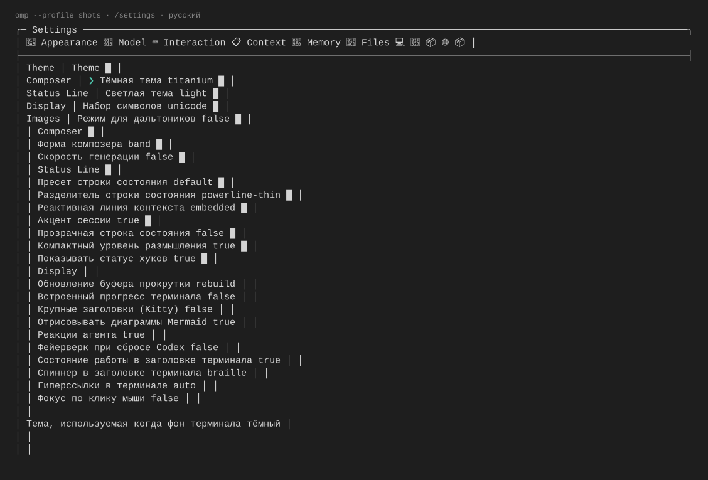
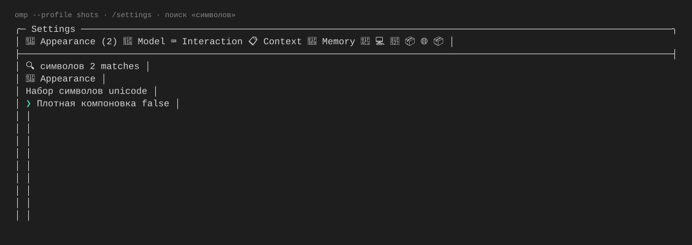

# omp-settings-ru

[](https://github.com/narimanisakhanov-creator/omp-settings-ru/actions/workflows/check.yml)
[](LICENSE)
[](https://github.com/narimanisakhanov-creator/omp-settings-ru/releases)

русский перевод штатной панели `/settings` в Oh My Pi. отдельное расширение; не форк OMP и не патч `omp.exe`.

переводит названия, описания, предупреждения и подписи статических вариантов 404 настроек OMP 18.8.0. значения (`off`, `auto`, идентификаторы моделей), обработчики, пути и пользовательские данные не меняются. вкладки, группы, подсказки навигации и динамические списки хоста остаются английскими. Stats, slash-autocomplete и остальная TUI не переводятся.

## как это выглядит

кадры из одноразового профиля (OMP 18.6.1, Windows; текст скопирован из живого терминала):

| русский `/settings` | русский поиск | возврат на английский |
| --- | --- | --- |
|  |  |  |

документация: [частые вопросы](docs/faq.md) · [глоссарий перевода](docs/glossary.md) · [архитектура](docs/architecture.md).

## установка

для OMP **18.8.0**. используйте фиксированный тег, а не изменяемую ветку `main`:

```powershell
omp plugin install git+https://github.com/narimanisakhanov-creator/omp-settings-ru.git#v0.2.0
```

затем запустите новую сессию и откройте `/settings`. менеджеру плагинов нужен Bun в PATH его процесса. альтернативный вариант без установки менеджером — скачать исходники [v0.2.0](https://github.com/narimanisakhanov-creator/omp-settings-ru/releases/tag/v0.2.0) и запустить расширение через `-e` из checkout, как описано ниже.

### обновление установленного плагина

в OMP **18.8.0** у `omp plugin` нет действия `update`. доступны `install|uninstall|list|link|doctor|features|config|enable|disable|marketplace|discover|upgrade`; `upgrade` обслуживает маркетплейс (проверка `omp plugin upgrade --dry-run` вернула `All marketplace plugins are up to date`). поэтому установленный плагин обновляется переустановкой:

```powershell
omp plugin uninstall omp-settings-ru
omp plugin install git+https://github.com/narimanisakhanov-creator/omp-settings-ru.git#<новый тег>
```

есть два канала:

- фиксированный тег — безопасный контроль версии, но следующий тег нужно установить вручную;
- ветка `stable`, которую релизный workflow двигает на последний проверенный тег: команда установки остаётся одной и той же, а содержимое меняется вместе с релизом.

```powershell
omp plugin install git+https://github.com/narimanisakhanov-creator/omp-settings-ru.git#stable
```

`stable` — подвижная ссылка: содержимое может измениться без твоего участия. фиксированный тег даёт контроль, но требует ручного шага. плагин не обновляет сам себя и не делает сетевых запросов (это его контракт приватности, см. раздел «приватность»). обновление применяется только при старте новой сессии после переустановки плагина. OMP 18.8.0 поддерживается; текущий пин — 18.8.0.

## запуск из checkout

нужен установленный OMP **18.8.0**. запуск исходного расширения через `-e` внутри OMP не требует отдельного Bun или установки зависимостей. штатный менеджер плагинов при удалении вызывает `bun`; для него нужен Bun, доступный в PATH данного процесса (глобальный PATH менять не обязательно).

```powershell
omp --no-extensions -e .\src\index.ts
```

`--no-extensions` отключает обнаружение других расширений, но сохраняет явно указанный `-e`. убери этот флаг, если нужны остальные расширения. для постоянного подключения после проверки:
```powershell
omp plugin link .
omp plugin doctor
```

команда меняет реестр плагинов выбранного профиля; здесь её не выполняли для рабочего профиля. после подключения открой новую сессию. для другого профиля используй `omp --profile <имя> plugin link .`.

`plugin link` и загрузка через обнаружение проверены в одноразовом профиле. `plugin doctor` показал 3 ok, 1 warning (`package_manifest: Not created yet`), 0 errors — у linked-профиля ещё нет npm manifest.


## язык и удаление

- при старте основной сессии включается русский;
- `/settings-language ru` — русский;
- `/settings-language en` — исходный английский;
- `/settings-language` — выбор языка;
- после переключения закрой и заново открой `/settings`;
- выбор языка не записывается в конфиг. следующая сессия опять стартует на русском;
- дочерний агент не может применить или снять перевод родителя.

```powershell
omp plugin uninstall omp-settings-ru
```

для немедленного возврата в текущей сессии сначала выполни `/settings-language en`. отключение или удаление плагина не объявляется горячим восстановлением; новая сессия без плагина всегда использует оригинальные тексты. при запуске через `-e` достаточно убрать аргумент.

## совместимость и ограничения

| хост / среда | проверка |
| --- | --- |
| установленный OMP 18.8.0, Windows x64 | smoke реальной панели с живым реестром 18.8.0 и smoke реестра; ручной прогон установленной панели не выполнялся |
| пакеты OMP 18.8.0, Windows x64, Bun 1.3.14 | доменные тесты, 404/404, drift 0, 5445 мутаций, smoke расширения и smoke штатной панели |
| пакеты OMP 18.8.0, Ubuntu 24.04 x64, Bun 1.3.14 | JSON-baseline эквивалентен win32; прогон Linux и CI на новой версии не проверены |
| macOS | baseline подготовлен; прогон macOS не проверен |

пока принимается только версия хоста 18.8.0. другие версии получают безопасный отказ, а не обещание совместимости. неизвестные настройки и изменившиеся исходные строки остаются английскими. нельзя одновременно включать другой переводчик того же реестра.

перед записью строится полный план. небезопасные дескрипторы блокируют перевод целиком. восстановление сохраняет последующие изменения другого расширения; полностью идентичную запись того же дескриптора JavaScript отличить не может. getter описания переводится только по проверенному шаблону: актуальные клавиши берутся у хоста. неожиданный текст getter остаётся английским.
если первичный откат не завершён, плагин удерживает план восстановления и показывает предупреждение. `/settings-language en` и завершение основной сессии повторяют восстановление, не затирая чужие изменения; повторное ru до этого не записывает новые данные.

## приватность

плагин не делает сетевых запросов, не собирает телеметрию, не читает ключи, содержимое сессий и текущие значения настроек для перевода. язык живёт в памяти процесса. OMP самостоятельно отвечает за свои сетевые функции и за сохранение настроек при твоих действиях в панели.

## разработка

```powershell
bun install --frozen-lockfile --ignore-scripts
bun run check
```

если Bun отсутствует, можно установить runtime только внутри игнорируемой `.tools`, не меняя PATH:

```powershell
npm.cmd install --prefix .tools --no-save --package-lock=false --ignore-scripts @oven/bun-windows-x64-baseline@1.3.14
.\.tools\node_modules\@oven\bun-windows-x64-baseline\bin\bun.exe --version
.\.tools\node_modules\@oven\bun-windows-x64-baseline\bin\bun.exe install --frozen-lockfile --ignore-scripts
.\.tools\node_modules\@oven\bun-windows-x64-baseline\bin\bun.exe run check
```

`check` включает строгий TypeScript, доменные тесты, покрытие, drift, реальный реестр, изолированный smoke штатного компонента панели и проверку состава npm-пакета/известных признаков секретов. последняя проверка — не гарантия обнаружения любого секрета. `smoke:panel` создаёт временный HOME, исключает наследование ключей и удаляет профиль после завершения. это не заменяет ручной запуск установленного `omp.exe` перед выпуском.

обновление переводов и выпуск: [CONTRIBUTING.md](CONTRIBUTING.md). изменения: [CHANGELOG.md](CHANGELOG.md). MIT; адаптированный механизм Elazer: [THIRD_PARTY_NOTICES.md](THIRD_PARTY_NOTICES.md).

выпуски публикуются в [GitHub Releases](https://github.com/narimanisakhanov-creator/omp-settings-ru/releases). npm-публикация не используется (`private: true`). ошибки и предложения: [Issues](https://github.com/narimanisakhanov-creator/omp-settings-ru/issues). уязвимости: [SECURITY.md](SECURITY.md).
