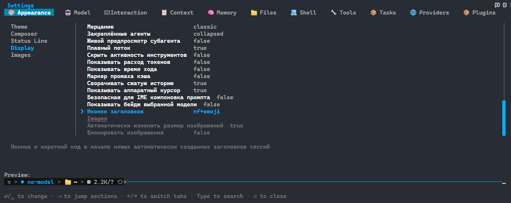

# omp-settings-ru

русский перевод штатной панели `/settings` в [Oh My Pi](https://github.com/can1357/oh-my-pi).
отдельное расширение — не форк OMP и не патч `omp.exe`.

переводит названия, описания, предупреждения и статические подписи вариантов.
значения, пути, идентификаторы моделей и обработчики не меняются.
вкладки, группы, динамические списки и остальная TUI остаются у хоста.



нативный кадр из изолированного профиля: «Иконки заголовков» и описание на русском.
[происхождение трёх снимков и границы проверки](docs/screenshots.md).

## установка

последний опубликованный выпуск — `v0.2.0`; он не содержит изменения из `v0.3.0`.
после завершения exact-SHA CI и публикации тега установи проверенный `v0.3.0` в текущий профиль:

```text
omp plugin install github:narimanisakhanov-creator/omp-settings-ru@v0.3.0
```

после установки открой новую сессию. Перед использованием проверь [совместимость](#проверенная-совместимость-checkout) и [процедуру проверки](CONTRIBUTING.md#проверка-установленного-хоста).

## язык и удаление

команды вводятся из основного промпта, не из поиска панели:

- `/settings-language ru` — русский;
- `/settings-language en` — исходный английский;
- `/settings-language` — выбор языка.

после переключения закрой и заново открой `/settings`.
язык относится к текущей сессии и не записывается в конфиг.
следующая основная сессия с плагином начинает с русского.

для немедленного возврата сначала выполни `/settings-language en`, затем удали плагин:

```text
omp plugin uninstall omp-settings-ru
```

новая сессия без плагина использует исходные тексты.
при запуске через `-e` убери этот аргумент.

## проверенная совместимость checkout

| OMP / среда | фактически проверено |
| --- | --- |
| 18.6.1 / Windows x64 | настоящий реестр пакета, 398/398 настроек; установленная панель не запускалась |
| 18.8.0 / Windows x64 | настоящий реестр пакета, 404/404 настроек; установленная панель не запускалась |
| 18.8.4 / Windows x64 | реестр 404/404; установленная панель, русский поиск, bool/enum, ru/en/ru и новая сессия без расширения |

это не таблица поддержки опубликованного тега.
Linux/macOS проверены по извлечённым исходникам, не по установленной панели.
на неизвестной версии совпадение пути и хеша позволяет перевести известные строки,
но не обещает совместимость; изменившиеся и неизвестные строки остаются английскими.

## подробнее

[FAQ](docs/faq.md) · [глоссарий](docs/glossary.md) · [архитектура](docs/architecture.md) · [сопровождение](CONTRIBUTING.md) · [изменения](CHANGELOG.md).

runtime перевода работает с метаданными в памяти; сеть и чтение ключей/сессий в нём не предусмотрены.
это граница кода, не результат сетевой трассировки. [безопасность](SECURITY.md).

[MIT](LICENSE). механизм адаптирован из `omp-settings-zh`, Copyright (c) 2026 Elazer; [атрибуция](THIRD_PARTY_NOTICES.md).
[ошибки и предложения](https://github.com/narimanisakhanov-creator/omp-settings-ru/issues) · [нормы поведения](CODE_OF_CONDUCT.md).
